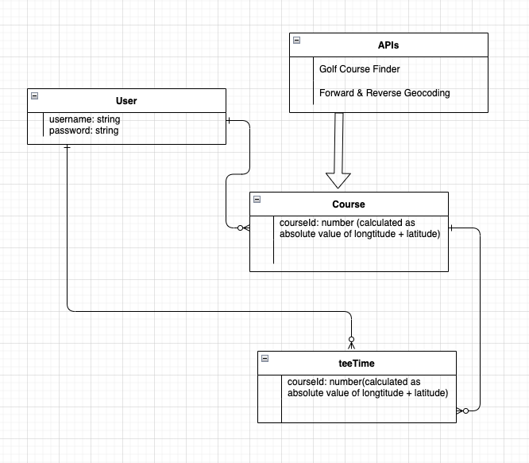

# Caddystack

***

### Link to deployed app:
#### https://caddystack.herokuapp.com/

***

### Link to client(front-end) repo:
#### https://github.com/cjones1047/caddystack-client

***

### PROJECT CONCEPT

Have you ever had a tee time at this spectacular, popular golf course that you couldn't make? Wouldn't it be nice to be able to sell it(especially if the course was going to charge you for not showing)?

Caddystack has your back. Utilizing React(front-end) and Express(back-end), Caddystack creates a marketplace for any golf course that lets golfers post their tee times for sale and also bid on other golfers' tee times. The golfer who owns the teetime can close bidding by accepting another golfer's bid at any time, at which point the accepting golfer will email reservation information to the golfer who's bid was accepted. The golfer who own the tee time can also just close bidding without accepting a bid, at which point all golfers that bid on the tee time will no longer see the tee time listed.

Golfers can also just save courses to a list called 'My Courses' which they can then refer to back to at any time. 'My Courses' page also allows you to take notes on any course for your own personal reference. This is useful to not just golfers but anyone looking to host an event at a number of nice courses, which tend to be able to accomodate large groups in their banquet areas

There is also a 'My Tee Times' page that displays all tee times that you own that are currently posted. This is perfect for referring back to all tee times you won OR posted that are still listed, and taking their listings down from the same place.

***

### ROUTES TABLE

| Verb   | URI Pattern         | Controller#Action |
| ------ | ------------------- | ----------------- |
| GET   | `/owner/:id`          | `user#show`    |
| POST   | `/sign-up`          | `users#new`    |
| POST   | `/sign-in`          | `users#edit`    |
| PATCH  | `/change-password/` | `users#put`  |
| DELETE | `/sign-out/`        | `users#delete`   |
| GET   | `/course/:courseId/:userId`          | `course#show`    |
| GET   | `/course`          | `course#index`    |
| POST   | `/course`          | `course#post`    |
| PATCH  | `/course/:id` | `course#put`  |
| DELETE | `/course/:courseId`        | `course#delete`   |
| GET   | `/all-my-teetimes`          | `teetime#index`    |
| GET   | `/teetime/:courseId`          | `teetime#index`    |
| POST   | `/teetime`          | `teetime#post`    |
| PATCH  | `/teetime/:id` | `teetime#put`  |
| DELETE | `/teetime/:id`        | `teetime#delete`   |

***

### APIs
##### Golf Course Finder
##### https://rapidapi.com/golfambit-golfambit-default/api/golf-course-finder/details

##### Forward & Reverse Geocoding
##### https://rapidapi.com/GeocodeSupport/api/forward-reverse-geocoding/details

***

### ERD (Entity Relationship Diagram)

